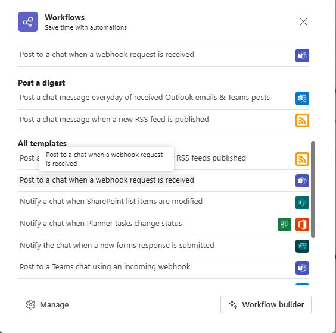

# Get Webhook URL
1. Click more option in Group chat:  

2. Click "Post to a chat when a webhook request is received"  

3. Click "Next"  

4. Find your group chat you want to receive message, and "Add workflow"  
  
5. Then you will have a webhook url, please paste it to config.ini  
### REMEMBER: change all "%" in URL to "%%"
